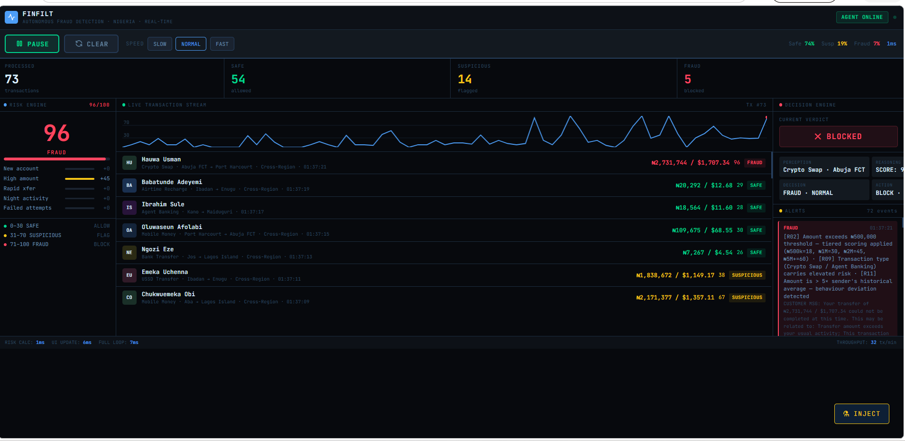

# 🛡️ FinFilt

**Autonomous Fraud Detection · Nigeria · Real-Time**

> A live fraud detection agent built for the Nigerian fintech ecosystem. The agent autonomously scores every transaction, builds memory across sessions, and evolves its threat response in real time — no ML library, no backend, no cost.

🔗 **[Live Demo →](https://PeaceJohn20.github.io/finfilt-agent)**

---

## What It Does

Most fraud detectors are calculators — they apply fixed rules and return a score. This agent is different. It **remembers**, **adapts**, and **evolves**:

- It builds a behavioural profile for every sender it sees
- It tracks how fast each sender is transacting (velocity)
- It detects when a sender deviates from their own personal baseline
- It monitors system-wide fraud pressure and tightens its scoring automatically when under attack
- It generates three-tier reason codes: what the customer sees, what ops sees, and what the compliance record contains

---

## Live Demo

Open `index.html` directly in any browser — no server, no install, no cost.

```bash
git clone https://github.com/PeaceJohn20/finfilt-agent.git
cd finfilt-agent
open index.html   # Mac
start index.html  # Windows
```

---

## Screenshots



---

## Features

| Feature | Description |
|---|---|
| Real-time simulation | New transactions fire every 2 seconds (adjustable) |
| Adaptive risk agent | Agent memory evolves with every transaction processed |
| 12 fraud signals | Rules-based + agent-learned signals scored and weighted |
| Correlation multiplier | Co-occurring signals amplify each other |
| Nigerian corridors | Real city pairs, zones, and regional risk profiles |
| Dual currency | All amounts shown in ₦ Naira and $ USD |
| Pressure monitor | Agent detects fraud waves and tightens scoring automatically |
| 3-tier reason codes | Customer message · Ops signals · Compliance record |
| Live risk chart | Sparkline tracking score history with threshold lines |
| Decision engine | Perception → Reasoning → Decision → Action agent loop |

---

## Risk Signals

### Rules-Based Signals
| Signal | Points | Trigger |
|---|---|---|
| New Account | +25 | Account flagged as recently opened |
| High Amount | +18–45 | Tiered: ₦500k / ₦1M / ₦2M+ |
| Rapid Transfer | +20 | Multiple transfers in short window |
| Night Activity | +8 | Transaction between 11pm – 5am |
| Failed Attempts | +12 | Prior failed transactions on account |
| High-Risk Zone | +12 | Origin city risk modifier elevated |
| Cross-Region | +8 | Origin and destination in different regions |
| Round Amount | +7 | Suspiciously round transfer figure |
| High-Risk Type | +14–22 | Crypto Swap (+22), Agent Banking (+14) |

### Agent-Learned Signals
| Signal | Points | How It Works |
|---|---|---|
| Velocity Breach | +20 | Same sender exceeds 3 transactions in 30 seconds |
| Behaviour Change | +18 | Transaction amount is 5× the sender's personal average |
| Repeat Offender | +24 | Sender's fraud rate exceeds 40% of their transaction history |

### Score → Decision
```
0  – 30   ✅  SAFE        →  ALLOW
31 – 70   ⚠️  SUSPICIOUS  →  FLAG FOR REVIEW
71 – 100  🚫  FRAUD       →  BLOCK + INCIDENT LOGGED
```

**Target distribution:** ~75% SAFE · ~17% SUSPICIOUS · ~8% FRAUD

---

## How the Agent Evolves

The agent maintains an `AgentMemory` object that persists across every transaction tick:

```
Transaction fires
       ↓
Agent checks sender profile  →  velocity breach? behaviour change? repeat offender?
       ↓
Score calculated  →  rules points + agent-learned points × correlation multiplier × pressure multiplier
       ↓
Decision made  →  SAFE / SUSPICIOUS / FRAUD
       ↓
Agent updates sender profile  →  transaction count, average amount, fraud rate
       ↓
Agent updates system pressure  →  if fraud rate > 45% in last 20 tx, tighten multiplier
```

In a production system, this feedback loop would be powered by:
- A live transaction API (Paystack, Flutterwave, Moniepoint,Vittpay webhook)
- A real user database (account age, transaction history)
- An ML model trained on historical Nigerian fraud data (XGBoost or similar)

---

## Nigerian Transaction Corridors

The engine models 15 real Nigerian city pairs as transaction corridors. Cross-region transfers carry higher inherent risk than intra-region transfers.

**High-risk zones:** Maiduguri (14) · Sokoto (9) · Aba (8) · Onitsha (7)

**Low-risk zones:** Abuja FCT (0) · Ibadan (2) · Uyo (3) · Enugu (3)

---

## File Structure

```
finfilt-agent/
├── index.html          — Page layout, no logic
├── css/
│   └── style.css       — All visual styles and colour variables
└── js/
    ├── engine.js       — Risk agent: memory, scoring, signals, reason codes
    ├── ui.js           — DOM updates: chart, feeds, KPIs, alerts
    ├── controls.js     — Buttons: pause, clear, speed
    └── inject.js       — Optional: manual transaction injection
```

---

## Customisation

**Change risk point weights:**
```js
// js/engine.js — RISK_RULES object
const RISK_RULES = {
  new_account: { points: 24, label: "New Account" },
  // ...
};
```

**Change exchange rate:**
```js
// js/engine.js
const USD_RATE = 1300;  // ₦1,600 per $1
```

**Add a new city:**
```js
// js/engine.js — ZONES array
{ name: "Asaba", region: "South-South", risk_modifier: 5 }
```

**Change simulation speed:**
Use the SLOW / NORMAL / FAST buttons, or edit `intervalMs` in `js/controls.js`

---

## Roadmap

| Version | What Changes |
|---|---|
| v1 (current) | Rules-based engine with agent memory and adaptive pressure |
| v2 | Replace scoring layer with XGBoost model trained on Nigerian transaction data |
| v3 | Close the feedback loop — analyst decisions retrain the model weekly |
| v4 | Connect to live Paystack / Flutterwave webhook for real transaction stream |

---

## Built With

- Vanilla JavaScript — no frameworks, no dependencies
- HTML5 Canvas — risk score sparkline chart
- CSS3 custom properties — full dark theme
- [Tabler Icons](https://tabler-icons.io) — UI icons
- [JetBrains Mono](https://fonts.google.com/specimen/JetBrains+Mono) — monospace font

---

## Author

**[Peace John]**
Built for [AI Unleashed Hackathon] · Nigerian Fintech Fraud Detection Track

---

## License

MIT — free to use, modify, and build on.
